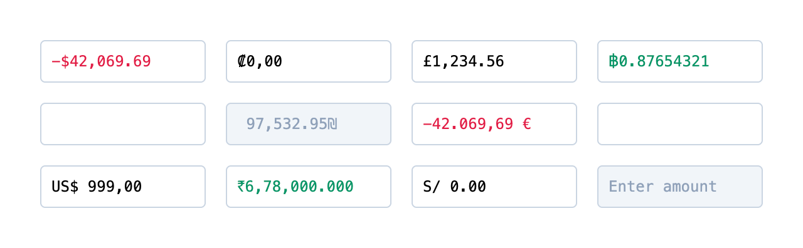

# svelte-currency-input

A fully-featured currency input component for Svelte 5 that handles formatting, localization, and validation as you type.



<p align="center">
  👩‍💻 Play with it in the <a href="https://svelte-currency-input.fernando.is" target="_blank">live demo</a>
</p>

---

- [Features](#features)
- [Installation](#installation)
- [Usage](#usage)
- [How it works](#how-it-works)
- [API](#api)
- [Examples](#examples)
- [Styling](#styling)
- [Exported utilities](#exported-utilities)
  - [formatValue options](#formatvalue-options)
- [Svelte 4 / migration guide](#svelte-4)
- [Contributing](#contributing)

## Features

- Formats **positive** and **negative** values
- Leverages [`Intl.NumberFormat`](https://developer.mozilla.org/en-US/docs/Web/JavaScript/Reference/Global_Objects/Intl/NumberFormat) for **localizing** currency denominations
- Supports **abbreviations** (k, m, b) for quick input
- Configurable **decimal precision** with multiple control options
- **Min/max constraints** with arrow key stepping
- Custom **prefix** and **suffix** support
- **Zero built-in styles** — works with Tailwind, vanilla CSS, or any framework
- Simple, single `<input>` element (no wrapper)
- Full **TypeScript** support
- **Lightweight** — ~3.6KB gzipped with no runtime dependencies
- API and logic heavily inspired by [@cchanxzy](https://github.com/cchanxzy)'s [react-currency-input-field](https://github.com/cchanxzy/react-currency-input-field)

## Installation

```bash
# bun
bun add @canutin/svelte-currency-input

# pnpm
pnpm add @canutin/svelte-currency-input

# npm
npm install @canutin/svelte-currency-input

# yarn
yarn add @canutin/svelte-currency-input
```

## Usage

```svelte
<script lang="ts">
	import { CurrencyInput } from '@canutin/svelte-currency-input';

	let value = $state('1234.56');
</script>

<CurrencyInput bind:value intlConfig={{ locale: 'en-US', currency: 'USD' }} />
```

The input displays `$1,234.56` while `value` contains the raw string `"1234.56"`.

## How it works

The component renders a single `<input>` element. The `value` prop is a **string** representing the unformatted number:

- `""` = empty input
- `"0"` = zero
- `"1234.56"` = the number 1234.56

The formatted display (e.g., `$1,234.56`) is handled internally. For form submissions where you need the raw value, you can add a hidden input:

```svelte
<form>
	<CurrencyInput bind:value name="display" />
	<input type="hidden" name="amount" {value} />
</form>
```

## API

### Props

| Prop                     | Type                                    | Default     | Description                                                                     |
| ------------------------ | --------------------------------------- | ----------- | ------------------------------------------------------------------------------- |
| `value`                  | `string`                                | `''`        | Bindable raw value (e.g., `"1234.56"`)                                          |
| `intlConfig`             | `IntlConfig`                            | `undefined` | Locale and currency configuration                                               |
| `prefix`                 | `string`                                | From locale | Override the currency prefix                                                    |
| `suffix`                 | `string`                                | `''`        | Override the currency suffix                                                    |
| `decimalSeparator`       | `string`                                | From locale | Override the decimal separator                                                  |
| `groupSeparator`         | `string`                                | From locale | Override the grouping separator                                                 |
| `disableGroupSeparators` | `boolean`                               | `false`     | Disable thousand separators                                                     |
| `allowDecimals`          | `boolean`                               | `true`      | Allow decimal values                                                            |
| `decimalsLimit`          | `number`                                | `2`         | Max decimal digits while typing                                                 |
| `decimalScale`           | `number`                                | `undefined` | Pad/trim decimals on blur                                                       |
| `fixedDecimalLength`     | `number`                                | `undefined` | Fixed decimal input (e.g., `2`: typing `123` → `1.23`)                          |
| `allowNegativeValue`     | `boolean`                               | `true`      | Allow negative values                                                           |
| `min`                    | `number`                                | `undefined` | Minimum value (enforced on arrow key step)                                      |
| `max`                    | `number`                                | `undefined` | Maximum value (enforced on arrow key step)                                      |
| `maxLength`              | `number`                                | `undefined` | Max characters (excluding formatting)                                           |
| `step`                   | `number`                                | `undefined` | Arrow key increment/decrement                                                   |
| `disableAbbreviations`   | `boolean`                               | `false`     | Disable k/m/b abbreviations                                                     |
| `formatValueOnBlur`      | `boolean`                               | `true`      | Apply formatting when input loses focus                                         |
| `transformRawValue`      | `(value: string) => string`             | `undefined` | Transform the raw value before processing                                       |
| `oninputvalue`           | `(values: CurrencyInputValues) => void` | `undefined` | Callback on every input change                                                  |
| `onchangevalue`          | `(values: CurrencyInputValues) => void` | `undefined` | Callback on blur/commit                                                         |
| `ref`                    | `HTMLInputElement \| null`              | `null`      | Bindable reference to the input element                                         |
| `class`                  | `string`                                | `undefined` | CSS class(es) for the input                                                     |
| `...restProps`           | `HTMLInputAttributes`                   | —           | All standard input attributes (id, name, placeholder, disabled, required, etc.) |

### Types

```typescript
interface IntlConfig {
	locale: string;
	currency?: string;
	// Also accepts other Intl.NumberFormatOptions
}

interface CurrencyInputValues {
	float: number | null; // Parsed number or null if empty
	formatted: string; // Display value: "$1,234.56"
	value: string; // Raw value: "1234.56"
}
```

## Examples

### International currencies

```svelte
<CurrencyInput bind:value intlConfig={{ locale: 'de-DE', currency: 'EUR' }} />
<!-- Displays: 1.234,56 € -->
```

### Decimal precision

```svelte
<!-- Limit to 2 decimals while typing, pad to 2 on blur -->
<CurrencyInput
	bind:value
	intlConfig={{ locale: 'en-US', currency: 'USD' }}
	decimalsLimit={2}
	decimalScale={2}
/>
```

### Min, max, and step

```svelte
<!-- Use arrow keys to increment/decrement by 10, constrained to 0-100 -->
<CurrencyInput
	bind:value
	intlConfig={{ locale: 'en-US', currency: 'USD' }}
	min={0}
	max={100}
	step={10}
/>
```

### Custom prefix and suffix

```svelte
<!-- Points system -->
<CurrencyInput bind:value suffix=" pts" decimalsLimit={0} />

<!-- Bitcoin -->
<CurrencyInput bind:value prefix="₿ " decimalsLimit={8} />
```

### Abbreviations

Type `1k`, `2.5m`, or `1b` to quickly enter large numbers:

```svelte
<CurrencyInput
	bind:value
	intlConfig={{ locale: 'en-US', currency: 'USD' }}
	placeholder="Try 1k, 2.5m, or 1b"
/>
<!-- Typing "2.5m" results in value="2500000" -->
```

### Callbacks

```svelte
<CurrencyInput
	bind:value
	intlConfig={{ locale: 'en-US', currency: 'USD' }}
	oninputvalue={({ float, formatted, value }) => {
		console.log('On input:', { float, formatted, value });
	}}
	onchangevalue={({ float, formatted, value }) => {
		console.log('On blur:', { float, formatted, value });
	}}
/>
```

### Input element reference

```svelte
<script>
	let inputRef = $state(null);

	function focusInput() {
		inputRef?.focus();
	}
</script>

<CurrencyInput bind:ref={inputRef} bind:value />
<button onclick={focusInput}>Focus</button>
```

## Styling

The component renders a single `<input>` element with no built-in styles. You can use the `class` prop to style it:

```svelte
<!-- Tailwind CSS -->
<CurrencyInput bind:value class="rounded border px-3 py-2 focus:ring-2 focus:ring-blue-500" />

<!-- Custom CSS class -->
<CurrencyInput bind:value class="my-currency-input" />
```

For dynamic styling based on value (positive/negative/zero), use the callback:

```svelte
<script>
	let value = $state('');
	let colorClass = $state('');

	function updateStyle({ float }) {
		if (float === null || float === 0) colorClass = 'text-gray-500';
		else if (float > 0) colorClass = 'text-green-600';
		else colorClass = 'text-red-600';
	}
</script>

<CurrencyInput bind:value class="border px-3 py-2 {colorClass}" oninputvalue={updateStyle} />
```

## Exported utilities

The package exports utility functions for use outside the component:

```typescript
import {
	formatValue,
	getLocaleConfig,
	cleanValue,
	parseAbbrValue,
	abbrValue
} from '@canutin/svelte-currency-input';

// Format a value with locale
const formatted = formatValue({
	value: '1234.56',
	intlConfig: { locale: 'en-US', currency: 'USD' }
});
// → "$1,234.56"

// Get locale configuration
const config = getLocaleConfig({ locale: 'de-DE', currency: 'EUR' });
// → { decimalSeparator: ',', groupSeparator: '.', prefix: '', suffix: ' €', ... }

// Parse abbreviations
const expanded = parseAbbrValue('2.5m', 'en-US');
// → "2500000"
```

### formatValue options

| Option                   | Type         | Default     | Description                                   |
| ------------------------ | ------------ | ----------- | --------------------------------------------- |
| `value`                  | `string`     | —           | The value to format                           |
| `intlConfig`             | `IntlConfig` | `undefined` | Locale and currency configuration             |
| `decimalScale`           | `number`     | `undefined` | Number of decimal places                      |
| `decimalSeparator`       | `string`     | From locale | Override the decimal separator                |
| `groupSeparator`         | `string`     | From locale | Override the grouping separator               |
| `disableGroupSeparators` | `boolean`    | `false`     | Disable thousand separators                   |
| `prefix`                 | `string`     | From locale | Override the currency prefix                  |
| `suffix`                 | `string`     | `''`        | Override the currency suffix                  |
| `roundValue`             | `boolean`    | `false`     | Round to `decimalScale` instead of truncating |

By default, `formatValue` truncates decimals to `decimalScale`. Set `roundValue: true` to round instead, which is useful when formatting computed values with floating-point precision artifacts:

```typescript
// Default: truncates
formatValue({
	value: '87.5',
	intlConfig: { locale: 'en-US', currency: 'USD' },
	decimalScale: 0
});
// → "$87"

// With roundValue: rounds
formatValue({
	value: '87.5',
	intlConfig: { locale: 'en-US', currency: 'USD' },
	decimalScale: 0,
	roundValue: true
});
// → "$88"

// Useful for computed values with floating-point issues
const sum = 500.75 + 300.5 - 200.25 - 150.33; // = 450.66999999999996
formatValue({
	value: String(sum),
	intlConfig: { locale: 'en-US', currency: 'USD' },
	decimalScale: 2,
	roundValue: true
});
// → "$450.67" (without roundValue, would be "$450.66")
```

## Svelte 4

For Svelte 4 support, use the [0.x version](https://github.com/fmaclen/svelte-currency-input/tree/v0.13.0):

```bash
npm install @canutin/svelte-currency-input@0
```

If you're upgrading from v0.x, see the [migration guide](./MIGRATION.md).

## Contributing

See [CONTRIBUTING.md](./CONTRIBUTING.md) for development setup, testing, and contribution guidelines.

## License

[MIT](./LICENSE)
